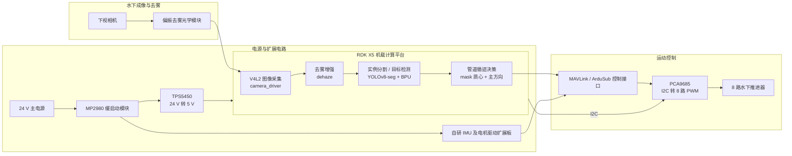

```mermaid
flowchart LR
  subgraph Optical["水下成像与去雾"]
    CAM["下视相机"]
    POL["偏振去雾光学模块"]
    CAM --> POL
  end

  subgraph Compute["RDK X5 机载计算平台"]
    V4L2["V4L2 图像采集<br/>camera_driver"]
    DEHAZE["去雾增强<br/>dehaze"]
    SEG["实例分割 / 目标检测<br/>YOLOv8-seg + BPU"]
    TRACK["管道循迹决策<br/>mask 质心 + 主方向"]
    V4L2 --> DEHAZE --> SEG --> TRACK
  end

  subgraph Control["运动控制"]
    MAV["MAVLink / ArduSub 控制接口"]
    PCA["PCA9685<br/>I2C 转 8 路 PWM"]
    THR["8 路水下推进器"]
    TRACK --> MAV --> PCA --> THR
  end

  subgraph Power["电源与扩展电路"]
    PWR["24 V 主电源"]
    SOFT["MP2980 缓启动模块"]
    BUCK["TPS5450<br/>24 V 转 5 V"]
    IMU["自研 IMU 及电机驱动扩展板"]
    PWR --> SOFT --> BUCK --> Compute
    SOFT --> IMU
    IMU --> MAV
  end

  POL --> V4L2
  Compute -- "I2C" --> PCA
```